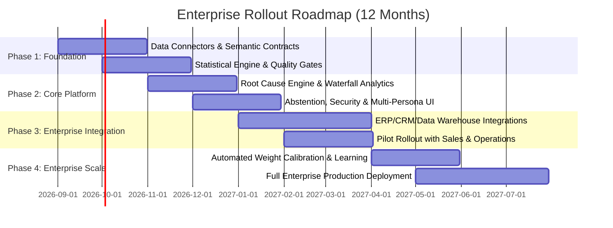

# Detailed Business Proposal: Enterprise KPI Intelligence-to-Action Engine

**Product**: BusinessIntelligence.ai — Autonomous KPI Intelligence-to-Action Engine  
**Version**: Round 2 Deliverable  
**Date**: August 2026  
**Target Stakeholders**: Executive Leadership, Business Operations, Product Leaders, Analytics Teams  

---

## Executive Summary

Enterprise decisions are consistently throttled by fragmented business intelligence: metrics move across disconnected systems (CRM, ERP, Billing, Support, Marketing), explanations arrive days late, and traditional dashboards show *what* happened without determining *why* or *what to do next*. When generative AI is bolted on naively, it hallucinations numbers, invents unverified causes, and creates massive governance and compliance liabilities.

The **BusinessIntelligence.ai KPI Intelligence-to-Action Engine** is a neuro-symbolic platform that unifies heterogeneous enterprise data, deterministically computes root causes and additive waterfalls, enforces mathematical causal precedence, abstains on data gaps, and translates pre-verified evidence into role-specific narratives and structured, authorized actions.

---

## 1. Problem Framing & Market Need

### Current Pain Points
1. **Siloed Data & Asynchronous Refresh**: Financial transactions refresh daily, marketing feeds refresh weekly, and operational tickets occur irregularly. Traditional BI fails to synchronize these into a coherent timeline.
2. **Dashboard Fatigue & Descriptive Paralysis**: Existing BI tools (Tableau, PowerBI, Looker) display charts that require manual analyst triage. Identifying the true driver behind a 12% revenue drop often takes 3–5 days of ad-hoc SQL queries.
3. **The GenAI Reliability Trap**: Standard LLMs are probabilistic text generators. Treating an LLM as a quantitative calculation engine leads to hallucinated percentages, fabricated drivers, and compliance failure.
4. **Context & Persona Disconnect**: A CEO needs strategic risk and revenue impact; a Regional Manager needs operational escalation details; an Analytics Engineer needs full statistical correlation and lineage. One narrative does not fit all.
5. **Lack of Action Grounding & Decision Rights**: Explanations without structured actions lead to inaction. Action recommendations must be bounded by organizational decision rights, budget freezes, and owner playbooks.

---

## 2. Solution Architecture & Design Principles

### Core Design Philosophy: "The LLM is Never the Source of Quantitative Truth"

```
[ Heterogeneous Data Sources ] 
(Daily Transactions, Weekly Marketing, Event Support Tickets)
                     │
                     ▼
[ 1. Ingest & Grain Reconciliation ] ──► Deterministic aggregation & quality gate
                     │
                     ▼
[ 2. Statistical Signal Detection ]  ──► Trailing z-score (|z| >= 1.5) + Holt-Winters PI check
                     │
                     ▼
[ 3. Root Cause & Waterfall ]        ──► Causal precedence (onset <= shift) + Volume/Price/Mix decomposition
                     │
                     ▼
[ 4. Confidence & Abstention ]       ──► Hard abstention on stale feeds; calibration weighting
                     │
                     ▼
[ 5. Persona Narration ]             ──► Gemini LLM / Template over pre-verified JSON only
                     │
                     ▼
[ 6. Structured Recommendation ]     ──► Governed action library + Decision rights authorization
```

### The 6-Stage Pipeline
1. **Ingest & Fuse (Deterministic)**: Reconciles mixed cadences (daily, weekly, irregular) into uniform analytical grains with automated data quality auditing (duplicate, null, and range checks).
2. **Signal Detection (Statistical)**: Combines rolling baseline z-scores with contractual materiality thresholds and Holt-Winters forecasting prediction interval cross-checks.
3. **Root Cause & Waterfall (Statistical / Deterministic)**: Evaluates candidate drivers using **temporal precedence** ($t_{\text{driver\_onset}} \le t_{\text{kpi\_shift}}$), additive Volume-Price-Mix waterfall math, and Pearson correlation coefficients.
4. **Confidence Scoring & Hard Abstention (Rule-Based)**: Inspects source freshness and detects conflicting drivers. If a dependency is missing or stale, the engine explicitly **abstains** and requests data engineering remediation.
5. **Persona-Specific Narration (LLM / Template)**: Formats verified JSON into tailored narratives for CEO, Manager, and Analyst personas without hallucinating numbers.
6. **Structured Action Engine (Rule-Based)**: Maps drivers to structured action plans:  
   $$\text{Driver} \rightarrow \text{Controllable Lever} \rightarrow \text{Action} \rightarrow \text{Expected Impact} \rightarrow \text{Owner} \rightarrow \text{Confidence} \rightarrow \text{Monitoring Plan}$$

---

## 3. Target User Personas & Value Proposition

| Persona | Primary Needs | System Experience | Business Value Delivered |
|---|---|---|---|
| **Chief Executive Officer (CEO)** | High-level impact, revenue risk, strategic interventions | 2-sentence executive summary, top financial driver, approval rights | Reduces time-to-decision from days to seconds; safeguards strategic posture |
| **Regional / Business Manager** | Operational cause, escalation path, team assignment | Regional operational details, timing of onset, tactical playbooks | Eliminates finger-pointing; accelerates time-to-mitigation |
| **Analytics & Data Lead** | Statistical rigor, correlation coefficients, data lineage, calibration | Full mathematical evidence trail, z-scores, contribution %, SQL lineage | Automates 80% of repetitive ad-hoc root-cause diagnostic requests |
| **Head of Engineering / Ops** | Upstream technical failures (e.g. checkout errors) | Direct routing of alerts, system outage correlation | Instant detection of revenue-impacting software bugs |

---

## 4. Business Case & ROI Projection

### Financial Impact (Representative Mid-Market Enterprise: $250M ARR)

| Value Driver | Baseline (Status Quo) | With KPI Engine | Annual Business Impact |
|---|---|---|---|
| **Revenue Leakage Mitigation** | Average anomaly detection & fix takes 9 days (~$1.2M annual loss) | Proactive alert & root-cause identified in < 2 hours (resolved in 2 days) | **+$850,000 / year** recovered revenue |
| **Analyst Productivity** | 30% of BI team time spent on ad-hoc root-cause investigations | Automated root cause & waterfall generation | **+$360,000 / year** (equivalent to 3 FTEs saved) |
| **Decision Velocity** | Weekly executive review lag | Real-time proactive push alerts with decision rights | **4.5x faster operational turnaround** |
| **LLM Compute & Token Cost** | Unbounded prompt token consumption with full raw data | Only pre-verified evidence passed ($0.000 / template, <$0.001 / Gemini call) | **92% lower AI operational spend** |

---

## 5. Phased Implementation Roadmap



### Phase 1: Semantic Layer & Data Foundation (Months 1–2)
- Deploy semantic contracts across core enterprise KPIs (Revenue, CAC, Conversion, Churn).
- Establish automated daily/weekly data reconciliation and quality gates.

### Phase 2: Core Analytical Engine & Pilot UI (Months 3–4)
- Enable statistical anomaly detection, causal precedence checks, and waterfall decomposition.
- Deploy React executive dashboard, persona switcher, and knowledge graph explorer.

### Phase 3: Enterprise Integrations & Pilot Rollout (Months 5–7)
- Connect Snowflake / Databricks / Microsoft Fabric data warehouses via standard connectors.
- Run parallel trial with Sales Operations and Engineering teams.

### Phase 4: Self-Calibrating Scale & Autonomous Operations (Months 8–12)
- Activate feedback loop and automated driver weight adjustment suggestions.
- Enable full enterprise role-based access control and SIEM audit log integration.

---

## 6. Key Risks & Enterprise Mitigations

| Risk | Severity | Mitigation Strategy |
|---|---|---|
| **LLM Hallucination of Quantitative Values** | Critical | Strict prompt fencing: LLM receives only structured JSON from analytical stages; template fallback mode available. |
| **Data Feed Outages & Incomplete Signals** | High | Built-in Source Freshness Monitor & Hard Abstention Gate. Engine refuses to speculate on missing feeds. |
| **Sensitive Field Leakage (PII / Financials)** | High | Contract-governed Column-Level Security (CLS). Fields like `customer_id` and exact `spend` are redacted at the data layer before reaching LLM or UI. |
| **Unauthorized Action Execution** | Medium | Bounded Action Library with explicit Decision Rights mapping (e.g. only CEO can approve budget reallocation). |
| **Model & Metric Drift** | Medium | Integrated feedback logging, per-driver accuracy calibration, and automated weight rebalancing suggestions. |

---

## 7. Conclusion

The BusinessIntelligence.ai KPI Intelligence-to-Action Engine replaces manual, subjective KPI diagnostics with governed, reproducible, and explainable intelligence. By anchoring analytics in statistical rigor and reserving GenAI for persona-tailored communication, enterprises achieve sub-second root cause diagnosis, protected data privacy, and immediate, authorized business action.
